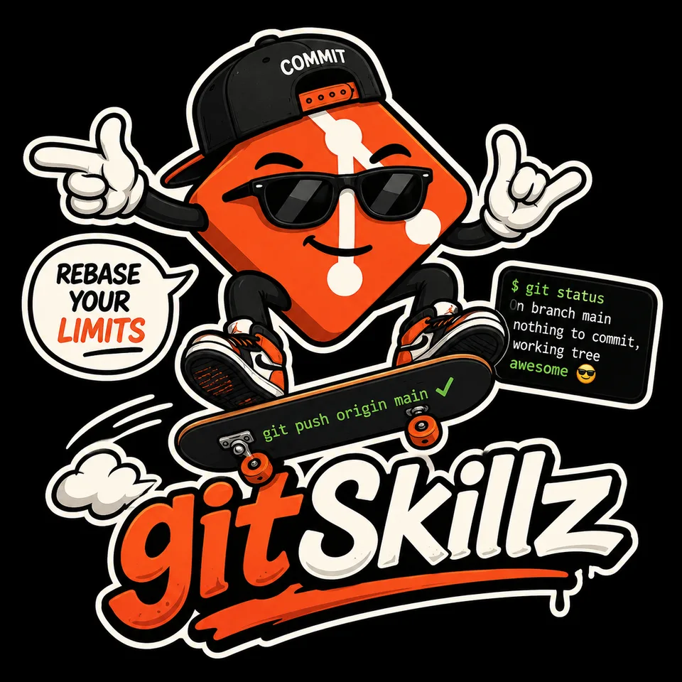
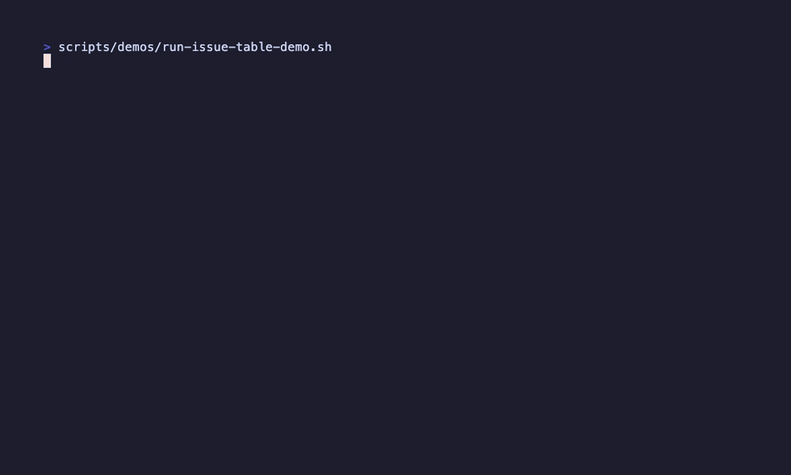

# Codex Git Skills

<p align="center">
  
</p>

Codex Git Skills is a global skill bundle for GitHub and GitLab workflows, plus repeatable terminal demo recording.

## Demo

`$git-issue-table` turns repository issues into a compact review queue with links and recommendations.

<p align="center">
  
</p>

It installs plain skill names:

- ⭐ `$git-workflow` - choose a Git, GitHub, or GitLab workflow
- ⭐ `$git-pr` - route GitHub pull request or GitLab merge request work
- ⭐ `$git-ci-watch` - watch CI for a branch, commit, latest push, pull request, merge request, run, or pipeline
- ⭐ `$git-issue-table` - summarize open GitHub issues or GitLab issues
- `$git-branch-sync` - inspect and safely synchronize local Git branches
- `$git-issue-details` - inspect one GitHub issue or GitLab issue
- `$git-issue-create` - create a GitHub issue or GitLab issue
- `$git-issue-update` - update one existing GitHub issue or GitLab issue
- `$git-pr-table` - summarize open GitHub pull requests or GitLab merge requests
- `$git-pr-watcher` - inspect one pull request or merge request
- `$git-pr-review` - review one pull request or merge request locally
- `$git-pr-address-comments` - address review comments on an existing pull request or merge request
- `$git-pr-create` - create a GitHub pull request or GitLab merge request with a concise or tabled description
- `$git-pr-update` - commit and push updates to an existing pull request or merge request
- `$git-pr-merge` - merge an approved pull request or merge request
- `$vhs` - create repeatable terminal screenshots, GIFs, and videos with Charmbracelet VHS

See [agent-matrix.md](agent-matrix.md) for the skill routing hierarchy.

The `git-pr-*` skills intentionally cover both GitHub pull requests and GitLab merge requests; provider-specific alias skills are not installed.

## Workflow Control

`$git-workflow` asks for an explicit endpoint before broad implementation requests such as "work on issue 49 to completion" when the prompt does not say whether completion means local verified changes, a local commit, a pushed branch, a PR/MR, or an issue update.

## Requirements

These skills are built around the platform CLIs:

- GitHub workflows require `gh` with authentication configured.
- GitLab workflows require `glab` with authentication configured.
- Helper scripts require `jq`.
- VHS demo rendering requires `vhs` and `ffmpeg`; some local installations also require `ttyd`.
- GIF optimization uses optional `gifsicle`.
- Local hook installation uses `prek`.

The skills prefer `gh` and `glab` for normal operations and use platform APIs only when the CLI output is missing required details.

## Helper Scripts

Helper scripts live under `scripts/git/` and emit normalized JSON for branch inspection, table, detail, CI, and explicitly confirmed issue creation workflows:

- `resolve-target.sh` - resolve the current checkout, named remote, GitHub/GitLab URL, explicit repository, or all remotes into normalized target JSON without platform API calls.
- `get-branch-state.sh` - inspect the current branch, upstream, default/base branch guess, dirty state summaries, ahead/behind counts, current HEAD, and local pushed/upstream HEADs for PR/MR create and update workflows.
- `get-issues.sh` - resolve the current checkout, named remote, or GitHub/GitLab URL and collect issues.
- `get-issue.sh` - resolve the current checkout, named remote, GitHub/GitLab URL, or issue URL and collect one issue's details.
- `get-prs.sh` - resolve the current checkout, named remote, GitHub/GitLab URL, or all remotes and collect PRs/MRs with table-ready status and color-hint fields.
- `get-pr.sh` - resolve the current checkout, named remote, GitHub/GitLab URL, PR/MR URL, number, or branch and collect one PR/MR's details.
- `get-ci.sh` - resolve the current checkout, named remote, GitHub/GitLab URL, or all remotes and collect CI status.
- `codex-color-probe.sh` - print rendering samples to test which color formats work in the current Codex surface.
- `create-issue.sh` - resolve the current checkout, named remote, or GitHub/GitLab URL before issue creation.
- `gh/get-issues.sh`, `gh/get-issue.sh`, `gh/get-prs.sh`, `gh/get-pr.sh`, `gh/get-ci.sh`, and `gh/create-issue.sh` - GitHub provider helpers.
- `glab/get-issues.sh`, `glab/get-issue.sh`, `glab/get-mrs.sh`, `glab/get-mr.sh`, `glab/get-ci.sh`, and `glab/create-issue.sh` - GitLab provider helpers.

Examples:

```bash
scripts/git/resolve-target.sh
scripts/git/resolve-target.sh upstream
scripts/git/resolve-target.sh --all-remotes
scripts/git/get-branch-state.sh
scripts/git/get-branch-state.sh --base master
scripts/git/get-issues.sh --state open --limit 50
scripts/git/get-issues.sh upstream --state open --limit 50
scripts/git/get-issue.sh 21
scripts/git/get-issue.sh upstream 2
scripts/git/get-issue.sh https://github.com/owner/repo/issues/21
scripts/git/get-prs.sh --state open --scope all --limit 50
scripts/git/get-prs.sh all remotes --state open --scope review --limit 50
scripts/git/get-pr.sh 31
scripts/git/get-pr.sh upstream --number 2
scripts/git/get-ci.sh --target-type branch --target master
scripts/git/get-ci.sh all remotes --target-type branch --target master
scripts/git/codex-color-probe.sh
scripts/git/gh/get-issues.sh --repo jeeftor/gitSkills --state open --limit 50
scripts/git/glab/get-issues.sh --repo jeef/gitskills --state opened --limit 50
scripts/git/gh/get-issue.sh --repo jeeftor/gitSkills --issue 21
scripts/git/glab/get-issue.sh --repo jeef/gitskills --issue 2
scripts/git/gh/get-prs.sh --repo jeeftor/gitSkills --state open --scope all --limit 50
scripts/git/glab/get-mrs.sh --repo jeef/gitskills --state opened --scope all --limit 50
scripts/git/gh/get-pr.sh --repo jeeftor/gitSkills --number 31
scripts/git/glab/get-mr.sh --repo jeef/gitskills --number 2
scripts/git/gh/get-ci.sh --repo jeeftor/gitSkills --target-type branch --target master
scripts/git/glab/get-ci.sh --repo group/project --target-type branch --target main
scripts/git/create-issue.sh --title "Issue title" --body-file /tmp/issue-body.md
scripts/git/create-issue.sh upstream --title "Issue title" --body "Short body" --yes
scripts/git/gh/create-issue.sh --repo jeeftor/gitSkills --title "Issue title" --yes
scripts/git/glab/create-issue.sh --repo group/project --title "Issue title" --yes
```

VHS helper scripts live under `scripts/vhs/` and keep terminal recordings repeatable:

- `check.sh` - check required VHS rendering tools and optional optimization tools.
- `render.sh` - validate or render one tape or all tapes, then report generated artifact sizes.
- `optimize-gif.sh` - run `gifsicle` optimization and replace a GIF only when the optimized file is smaller.
- `new-demo.sh` - create a starter tape using deterministic repo defaults.

Examples:

```bash
make vhs-check
make vhs-validate
make vhs
make vhs-one DEMO=git-workflow
make vhs-new DEMO=example
scripts/vhs/render.sh docs/demos/tapes/git-workflow.tape
```

VHS tapes live under `docs/demos/tapes/` by default, and generated media is written to `docs/demos/output/`. The output directory intentionally keeps only `.gitkeep` tracked; rendered media remains ignored unless a change explicitly chooses to commit it.

## Install

From this checkout:

```bash
make install
```

The installer copies skills to:

```text
~/.agents/skills/
```

Shared workflow references are kept once in this repository under `references/git-workflow/`.
Shared Git helper scripts are kept under `scripts/git/`.
Shared VHS helper scripts are kept under `scripts/vhs/`.
During install, those references and helpers are copied once into `~/.agents/gitSkills/`. Each installed Git skill gets lightweight `references/git-workflow` and `scripts/git` symlinks back to that shared location, and `$vhs` gets a `scripts/vhs` symlink.

Restart Codex after installation.

## Development

This repository uses `master` as its default branch.

List available Make targets:

```bash
make
```

Validate before pushing:

```bash
make validate
```

Validation checks shell syntax, static skill routing references, helper/reference paths, skill frontmatter, and local helper JSON contracts.

Run the GitHub Actions-safe validation path with:

```bash
make ci
```

`make ci` avoids Codex-specific local validators and runs repo-local checks that can run on a standard GitHub-hosted runner.
The hosted `Validate` workflow runs `make ci` on pull requests, pushes to `master`, and manual dispatch.

Run the local-only helper smoke tests directly with:

```bash
make test-helpers
```

The helper smoke tests create a temporary Git repository, avoid platform authentication, and validate `resolve-target.sh` and `get-branch-state.sh` JSON shape with `jq`.

Validate VHS tooling and tapes locally with:

```bash
make vhs-check
make vhs-validate
```

Run optional ShellCheck validation for scripts with:

```bash
make shellcheck
```

Install the local commit hook with:

```bash
prek install
```

The hook runs `make validate` before each commit.

The skills use shared references under `references/git-workflow/`, helper scripts under `scripts/git/`, and load GitHub or GitLab details only after detecting the repository host.
