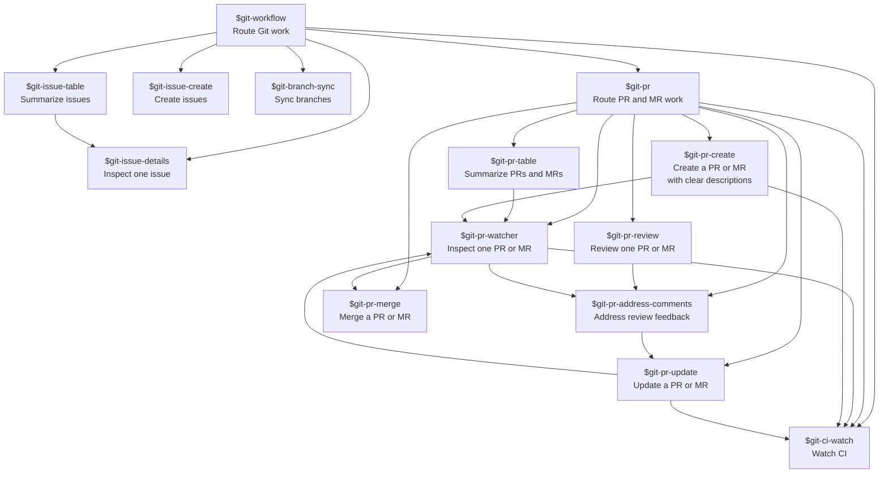

# Git Skill Matrix

Read-only overview skills should run before mutating create, update, or merge workflows when the target item is ambiguous.
`$git-issue-table` uses `scripts/git/get-issues.sh` for the common scripted issue collection path.
`$git-issue-details` uses `scripts/git/get-issue.sh` for the common scripted issue detail path before recommending next actions.
`$git-branch-sync` uses `scripts/git/get-branch-state.sh` before recommending or performing branch sync mutations.
`$git-pr-table` uses `scripts/git/get-prs.sh` for the common scripted PR/MR collection path before handing one selected item to `$git-pr-watcher`.
`$git-pr-watcher` uses `scripts/git/get-pr.sh` for the common scripted PR/MR detail path before recommending next actions.
`$git-pr-review` uses `scripts/git/get-pr.sh` for initial status context before diff inspection and findings.
Use `$git-ci-watch` instead of `$git-pr-watcher` when the user only asks about CI for the latest push, branch, commit, run, pipeline, PR, or MR.
`$git-ci-watch` uses `scripts/git/get-ci.sh` for common scripted CI target resolution before provider-specific collection.
