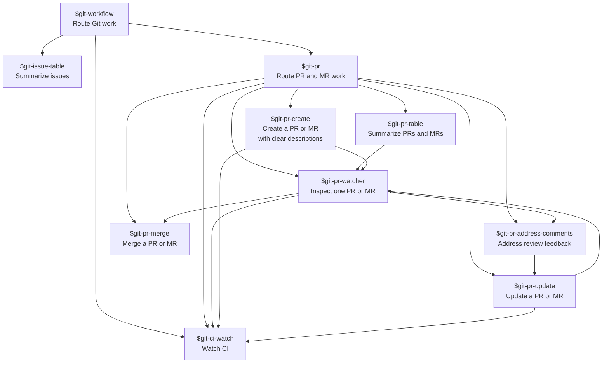

# Git Skill Matrix

Read-only overview skills should run before mutating create, update, or merge workflows when the target item is ambiguous.
Use `$git-ci-watch` instead of `$git-pr-watcher` when the user only asks about CI for the latest push, branch, commit, run, pipeline, PR, or MR.
