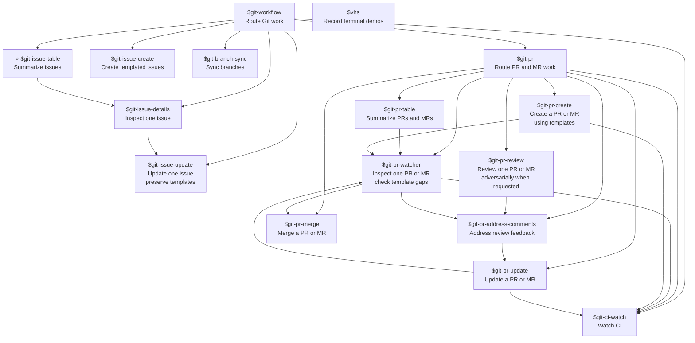

# Git Skill Matrix

These skills ship inside the `git-skills` Codex plugin. `$git-workflow` is the generic Git entry point: it resolves the local repository target, detects GitHub or GitLab when possible, and then routes to the smallest specialist workflow.

```mermaid
flowchart TD
    WORKFLOW["$git-workflow<br/>Route Git work"]
    VHS["$vhs<br/>Record terminal demos"]
    ISSUE_TABLE["⭐ $git-issue-table<br/>Summarize issues"]
    ISSUE_DETAILS["$git-issue-details<br/>Inspect one issue"]
    ISSUE_CREATE["$git-issue-create<br/>Create templated issues"]
    ISSUE_UPDATE["$git-issue-update<br/>Update one issue<br/>preserve templates"]
    BRANCH_SYNC["$git-branch-sync<br/>Sync branches"]
    PR["$git-pr<br/>Route PR and MR work"]
    PR_TABLE["$git-pr-table<br/>Summarize PRs and MRs"]
    PR_WATCHER["$git-pr-watcher<br/>Inspect one PR or MR<br/>check template gaps"]
    PR_REVIEW["$git-pr-review<br/>Review one PR or MR<br/>adversarially when requested"]
    PR_ADDRESS["$git-pr-address-comments<br/>Address review feedback"]
    CI_WATCH["$git-ci-watch<br/>Watch CI"]
    PR_CREATE["$git-pr-create<br/>Create a PR or MR<br/>using templates"]
    PR_UPDATE["$git-pr-update<br/>Update a PR or MR"]
    PR_MERGE["$git-pr-merge<br/>Merge a PR or MR"]

    WORKFLOW --> ISSUE_TABLE
    WORKFLOW --> ISSUE_DETAILS
    WORKFLOW --> ISSUE_CREATE
    WORKFLOW --> ISSUE_UPDATE
    WORKFLOW --> BRANCH_SYNC
    WORKFLOW --> PR
    WORKFLOW --> CI_WATCH
    ISSUE_TABLE --> ISSUE_DETAILS
    ISSUE_DETAILS --> ISSUE_UPDATE
    PR --> PR_TABLE
    PR --> PR_WATCHER
    PR --> PR_REVIEW
    PR --> PR_ADDRESS
    PR --> CI_WATCH
    PR --> PR_CREATE
    PR --> PR_UPDATE
    PR --> PR_MERGE
    PR_TABLE --> PR_WATCHER
    PR_REVIEW --> PR_ADDRESS
    PR_WATCHER --> CI_WATCH
    PR_WATCHER --> PR_ADDRESS
    PR_ADDRESS --> PR_UPDATE
    PR_CREATE --> PR_WATCHER
    PR_CREATE --> CI_WATCH
    PR_UPDATE --> CI_WATCH
    PR_UPDATE --> PR_WATCHER
    PR_WATCHER --> PR_MERGE
```

`$vhs` is an independent utility skill for repeatable terminal screenshots, GIFs, videos, and VHS runner guidance. It is not routed through `$git-workflow`.

Read-only overview skills should run before mutating create, update, or merge workflows when the target item is ambiguous.
`$git-workflow` asks for an explicit completion endpoint before broad implementation requests such as "work on issue 49 to completion" when commit, push, PR/MR, or issue closure behavior is not stated.
Commit, push, PR, and MR delivery workflows establish a non-default feature branch before staging or committing, then preserve accidental default-branch commits before restoring the local default branch.
Completed workflows use `references/git-workflow/common.md` completion handoff guidance to recommend only the smallest useful next skill or known issue-table item.
`$git-issue-table` uses `scripts/git/get-issues.sh` for the common scripted issue collection path.
`$git-issue-details` uses `scripts/git/get-issue.sh` for the common scripted issue detail path before recommending next actions.
`$git-issue-update` uses `scripts/git/get-issue.sh` before and after explicit one-issue mutations.
`$git-issue-create` and issue body updates inspect repo-local issue templates, use the only applicable template automatically, and ask when multiple templates apply.
`$git-branch-sync` uses `scripts/git/get-branch-state.sh` before recommending or performing branch sync mutations.
`$git-pr-table` uses `scripts/git/get-prs.sh` for the common scripted PR/MR collection path before handing one selected item to `$git-pr-watcher`.
`$git-pr-watcher` uses `scripts/git/get-pr.sh` for the common scripted PR/MR detail path before recommending next actions, including explicit target-project lookup for GitLab fork-to-upstream MR discussions.
`$git-pr-review` uses `scripts/git/get-pr.sh` for initial status context before diff inspection and findings, and includes a `codex-security:security-diff-scan` pass for adversarial or security review requests when available.
`$git-pr-create`, `$git-pr-watcher`, and `$git-pr-review` inspect repo-local PR/MR templates when composing or evaluating descriptions, use the only applicable template automatically for creation, and flag missing required template sections in read-only workflows.
Use `$git-ci-watch` instead of `$git-pr-watcher` when the user only asks about CI for the latest push, branch, commit, run, pipeline, PR, or MR.
`$git-ci-watch` uses `scripts/git/get-ci.sh` for common scripted CI target resolution before provider-specific collection.
